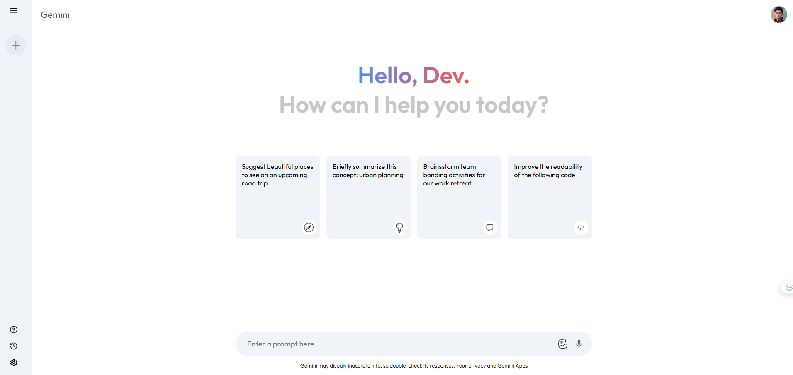

# Gemini Clone

A simple Gemini clone built using **React** and integrated with the **Gemini API**. This project demonstrates fetching and displaying cryptocurrency data using modern frontend technologies.

## Technologies Used

- **React**: For building the user interface.
- **Gemini API**: To fetch real-time cryptocurrency data.
- **CSS/Styled Components**: (Specify your styling method)

## Getting Started

### Prerequisites

Ensure you have the following installed on your system:

- **Node.js** (v18 or higher)
- **npm**

### Installation

1. Clone the repository:

   ```bash
   git clone https://github.com/fasih6/simple-gemini-clone.git
   cd gemini-clone
   ```

2. Install dependencies:

   ```bash
   npm install
   ```

3. Add your Gemini API key. Create a .env file in the root directory and include:

   ```bash
   VITE_API_KEY=""
   ```

4. Add this to you gemini.js file like this:

   ```bash
   const apiKey = import.meta.env.VITE_API_KEY;
   ```

5. Start the development server:
   ```bash
   npm run dev
   ```


